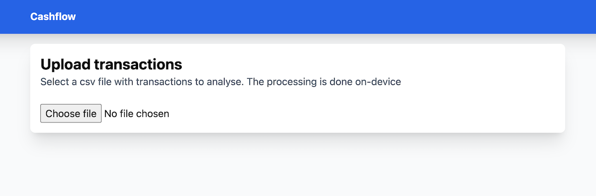
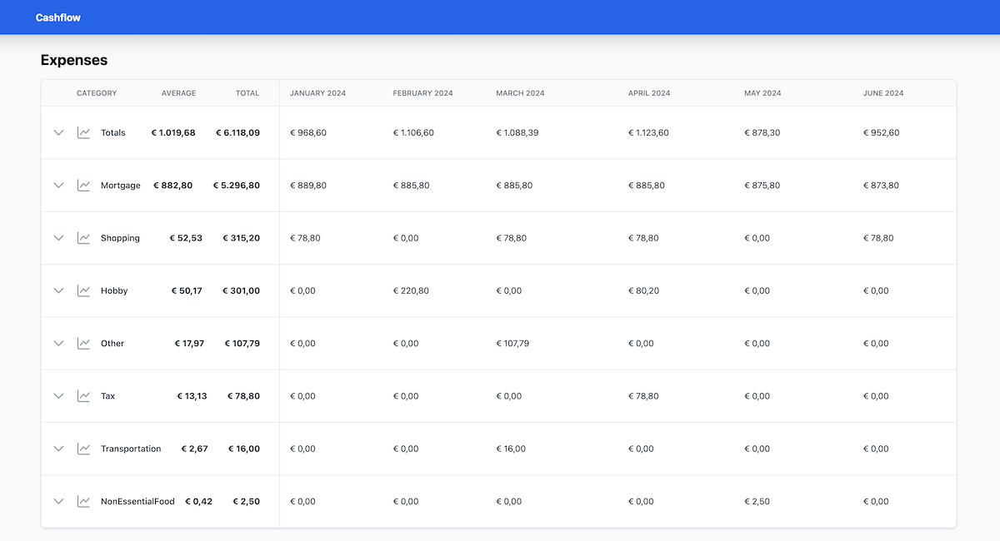
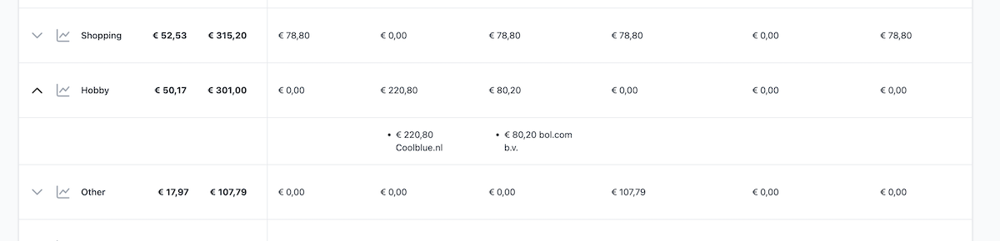
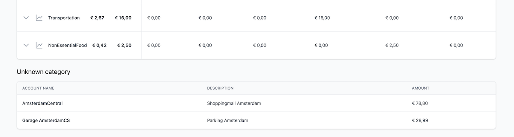
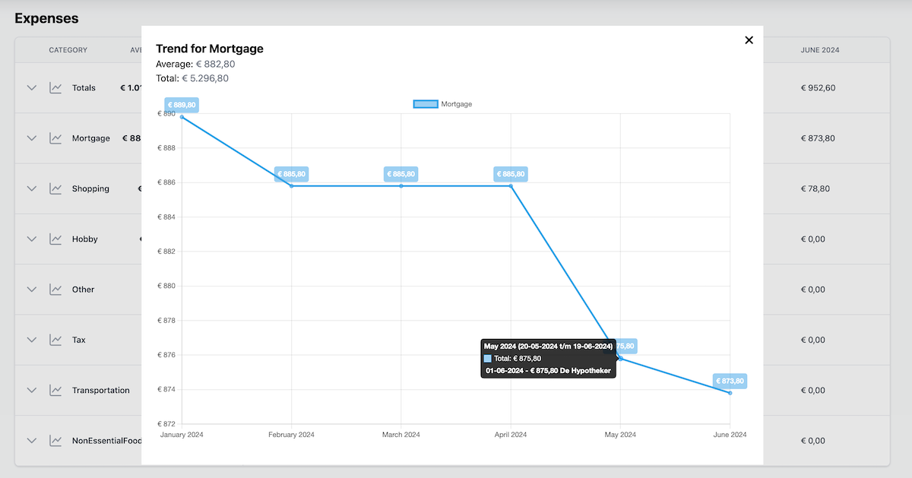
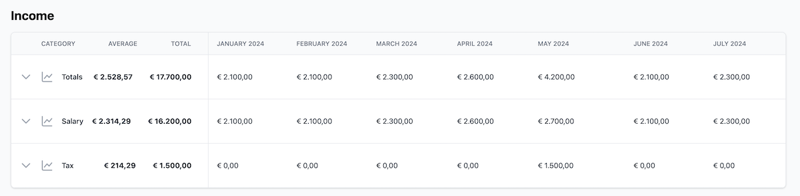
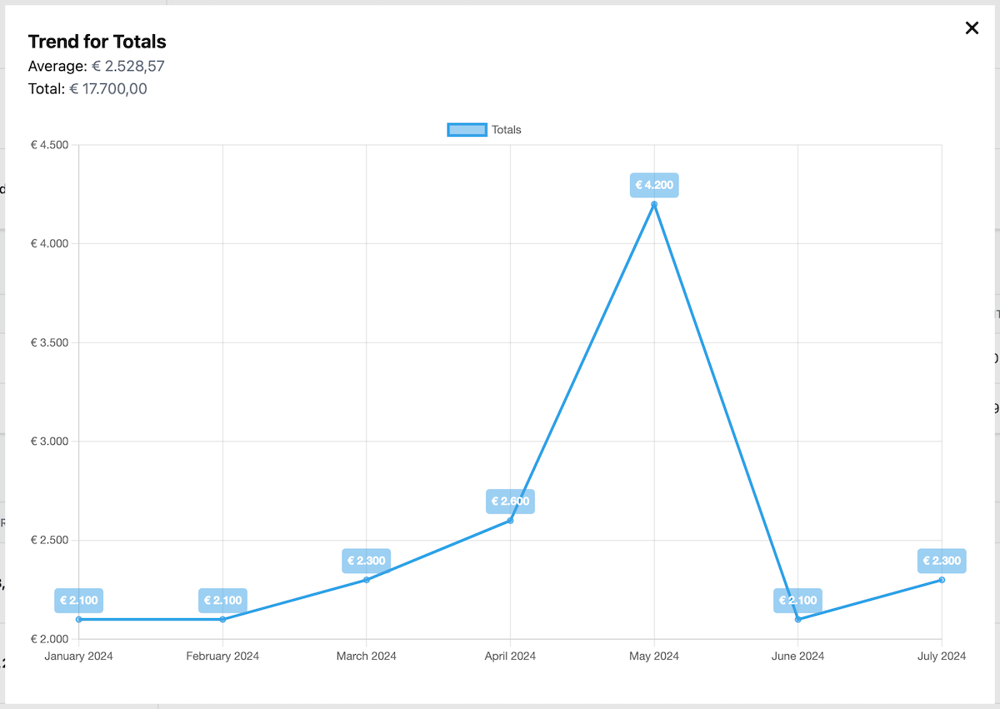

# Cashflow

Application to get insights into expenses and income based on transaction exports from banks.

It takes salary paydays into account to show a more realistic picture of the money spend.

## Screenshots

#### Upload transactions export

#### Expenses overview

#### View transactions by month

#### View transaction without a category

#### View history per category

#### Income overview

#### Totals by month

